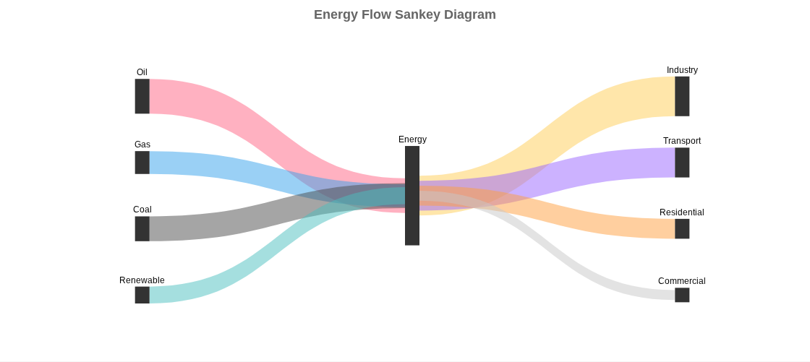

# Chart.js Sankey Plugin

A powerful Chart.js plugin for creating beautiful Sankey diagrams to visualize flow data.

[](https://www.npmjs.com/package/chartjs-plugin-sankey)
[](https://opensource.org/licenses/MIT)

## Features

- 🎨 Customizable colors for flows and nodes
- 📊 Automatic node positioning and layout
- 🔄 Support for complex flow networks
- 📱 Responsive and interactive
- 🎯 Easy to use with Chart.js ecosystem
- ⚡ Lightweight and performant

## Sample Diagram

Here's an example of what you can create with this plugin:

```
Energy Flow Sankey Diagram

    Oil ──────────────┐
                      ├──► Energy ──────┬──► Industry
    Gas ──────────────┤                 │
                      │                 ├──► Transport
    Coal ─────────────┤                 │
                      │                 ├──► Residential
    Renewable ────────┘                 │
                                        └──► Commercial
```



## Installation

### NPM

```bash
npm install chartjs-plugin-sankey chart.js
```

### CDN

```html
<script src="https://cdn.jsdelivr.net/npm/chart.js@4.4.0/dist/chart.umd.min.js"></script>
<script src="https://cdn.jsdelivr.net/npm/chartjs-plugin-sankey/dist/chartjs-plugin-sankey.min.js"></script>
```

## Quick Start

### Basic Usage

```html
<!DOCTYPE html>
<html>
<head>
  <title>Sankey Chart Example</title>
</head>
<body>
  <canvas id="myChart"></canvas>

  <script src="https://cdn.jsdelivr.net/npm/chart.js"></script>
  <script src="https://cdn.jsdelivr.net/npm/chartjs-plugin-sankey"></script>

  <script>
    const ctx = document.getElementById('myChart').getContext('2d');

    new Chart(ctx, {
      type: 'sankey',
      data: {
        datasets: [{
          label: 'My Sankey Dataset',
          data: [
            { from: 'A', to: 'B', flow: 10 },
            { from: 'A', to: 'C', flow: 5 },
            { from: 'B', to: 'D', flow: 8 },
            { from: 'C', to: 'D', flow: 5 }
          ]
        }]
      }
    });
  </script>
</body>
</html>
```

### ES6 Module

```javascript
import { Chart } from 'chart.js';
import { SankeyController } from 'chartjs-plugin-sankey';

Chart.register(SankeyController);

const chart = new Chart(ctx, {
  type: 'sankey',
  data: {
    datasets: [{
      data: [
        { from: 'Source A', to: 'Target B', flow: 100 },
        { from: 'Source A', to: 'Target C', flow: 50 },
        { from: 'Target B', to: 'End', flow: 75 },
        { from: 'Target C', to: 'End', flow: 50 }
      ]
    }]
  },
  options: {
    responsive: true,
    maintainAspectRatio: false
  }
});
```

## Data Format

The plugin expects data in the following format:

```javascript
{
  datasets: [{
    data: [
      {
        from: 'Node A',    // Source node name
        to: 'Node B',      // Target node name
        flow: 10,          // Flow value (number)
        color: 'rgba(...)' // Optional: custom color for this flow
      },
      // ... more flows
    ],
    color: 'rgba(...)' // Optional: default color for all flows
  }]
}
```

## Configuration Options

### Dataset Options

| Option | Type | Default | Description |
|--------|------|---------|-------------|
| `data` | `Array<FlowData>` | `[]` | Array of flow data objects |
| `color` | `string` | Auto-generated | Default color for flows |

### Flow Data Object

| Property | Type | Required | Description |
|----------|------|----------|-------------|
| `from` | `string` | Yes | Source node identifier |
| `to` | `string` | Yes | Target node identifier |
| `flow` | `number` | Yes | Flow value/weight |
| `color` | `string` | No | Custom color for this flow |

## Examples

### Energy Flow Example

```javascript
const energyData = {
  datasets: [{
    label: 'Energy Flow',
    data: [
      { from: 'Oil', to: 'Energy', flow: 35, color: 'rgba(255, 99, 132, 0.5)' },
      { from: 'Gas', to: 'Energy', flow: 23, color: 'rgba(54, 162, 235, 0.5)' },
      { from: 'Coal', to: 'Energy', flow: 25, color: 'rgba(75, 75, 75, 0.5)' },
      { from: 'Renewable', to: 'Energy', flow: 17, color: 'rgba(75, 192, 192, 0.5)' },
      { from: 'Energy', to: 'Industry', flow: 40, color: 'rgba(255, 206, 86, 0.5)' },
      { from: 'Energy', to: 'Transport', flow: 30, color: 'rgba(153, 102, 255, 0.5)' },
      { from: 'Energy', to: 'Residential', flow: 20, color: 'rgba(255, 159, 64, 0.5)' },
      { from: 'Energy', to: 'Commercial', flow: 10, color: 'rgba(199, 199, 199, 0.5)' }
    ]
  }]
};

new Chart(ctx, {
  type: 'sankey',
  data: energyData,
  options: {
    responsive: true,
    plugins: {
      title: {
        display: true,
        text: 'Energy Flow Distribution'
      }
    }
  }
});
```

### Budget Allocation Example

```javascript
const budgetData = {
  datasets: [{
    label: 'Budget Allocation',
    data: [
      { from: 'Budget', to: 'Development', flow: 50000 },
      { from: 'Budget', to: 'Marketing', flow: 30000 },
      { from: 'Budget', to: 'Operations', flow: 20000 },
      { from: 'Development', to: 'Frontend', flow: 30000 },
      { from: 'Development', to: 'Backend', flow: 20000 },
      { from: 'Marketing', to: 'Digital', flow: 20000 },
      { from: 'Marketing', to: 'Traditional', flow: 10000 }
    ]
  }]
};
```

### Customer Journey Example

```javascript
const journeyData = {
  datasets: [{
    label: 'Customer Journey',
    data: [
      { from: 'Website', to: 'Product Page', flow: 1000 },
      { from: 'Social Media', to: 'Product Page', flow: 500 },
      { from: 'Product Page', to: 'Cart', flow: 600 },
      { from: 'Product Page', to: 'Exit', flow: 900 },
      { from: 'Cart', to: 'Checkout', flow: 400 },
      { from: 'Cart', to: 'Exit', flow: 200 },
      { from: 'Checkout', to: 'Purchase', flow: 350 }
    ]
  }]
};
```

## Chart Options

The Sankey plugin supports standard Chart.js options:

```javascript
options: {
  responsive: true,
  maintainAspectRatio: false,
  plugins: {
    title: {
      display: true,
      text: 'Your Chart Title'
    },
    legend: {
      display: false  // Legend not typically used for Sankey diagrams
    },
    tooltip: {
      enabled: true
    }
  }
}
```

## Development

### Building from Source

```bash
# Clone the repository
git clone https://github.com/larrymotalavigne/chartjs-sankey.git
cd chartjs-sankey

# Install dependencies
npm install

# Build the plugin
npm run build

# Watch for changes during development
npm run dev
```

### Project Structure

```
chartjs-sankey/
├── src/
│   └── index.js          # Main plugin source
├── dist/
│   ├── chartjs-plugin-sankey.js      # UMD build
│   ├── chartjs-plugin-sankey.min.js  # Minified UMD build
│   ├── chartjs-plugin-sankey.esm.js  # ES module build
│   └── index.d.ts                     # TypeScript definitions
├── examples/
│   └── index.html        # Live examples
├── .github/
│   └── workflows/        # CI/CD pipelines
├── package.json
├── rollup.config.js
└── README.md
```

## Publishing

The package is automatically published to NPM when a new release is created on GitHub.

### Manual Publishing

To publish manually:

1. Ensure you have NPM publishing rights
2. Create an NPM token and add it to GitHub secrets as `NPM_TOKEN`
3. Create a new release on GitHub, or use the workflow dispatch

### Using GitHub Actions

The repository includes two workflows:

1. **CI** (`.github/workflows/ci.yml`) - Runs on every push and PR
   - Builds the project
   - Runs on Node.js 18.x and 20.x

2. **Publish** (`.github/workflows/publish.yml`) - Publishes to NPM
   - Triggered on new releases
   - Can be manually triggered with version bump (patch/minor/major)

To publish a new version:

```bash
# Via GitHub UI
1. Go to Actions tab
2. Select "Publish to NPM" workflow
3. Click "Run workflow"
4. Select version bump type (patch/minor/major)
```

## Browser Support

This plugin supports all browsers that Chart.js 4.x supports:

- Chrome (latest)
- Firefox (latest)
- Safari (latest)
- Edge (latest)

## TypeScript Support

The plugin includes TypeScript definitions. Import and use with full type safety:

```typescript
import { Chart } from 'chart.js';
import { SankeyController, SankeyDataPoint } from 'chartjs-plugin-sankey';

Chart.register(SankeyController);

const data: SankeyDataPoint[] = [
  { from: 'A', to: 'B', flow: 10 },
  { from: 'B', to: 'C', flow: 5 }
];
```

## Contributing

Contributions are welcome! Please feel free to submit a Pull Request.

1. Fork the repository
2. Create your feature branch (`git checkout -b feature/amazing-feature`)
3. Commit your changes (`git commit -m 'Add some amazing feature'`)
4. Push to the branch (`git push origin feature/amazing-feature`)
5. Open a Pull Request

## License

MIT © 2025

## Acknowledgments

- Built on top of [Chart.js](https://www.chartjs.org/)
- Inspired by D3.js Sankey diagrams

## Related Projects

- [Chart.js](https://www.chartjs.org/) - Simple yet flexible JavaScript charting
- [chartjs-chart-sankey](https://github.com/kurkle/chartjs-chart-sankey) - Alternative Sankey implementation

## Support

- 📖 [Documentation](https://github.com/larrymotalavigne/chartjs-sankey#readme)
- 🐛 [Issue Tracker](https://github.com/larrymotalavigne/chartjs-sankey/issues)
- 💬 [Discussions](https://github.com/larrymotalavigne/chartjs-sankey/discussions)

---

Made with ❤️ for the Chart.js community
